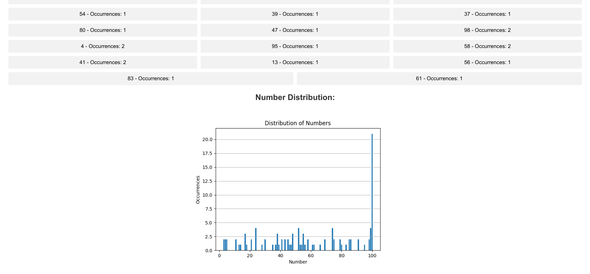

# Quantum Random Number Generator

This project is an implementation of a quantum random number generator using the Qiskit integrated into a Flask web application. It includes a simple web interface allowing users to generate random numbers and visualise the distribution through a graph plot using Matplotlib.

## Getting Started

1. Clone this repository:

```bash
git clone https://github.com/Kairos-T/QRNG
cd QRNG
```

2. (Optional) Create a virtual environment:

```bash
sudo python3 -m venv venv
source venv/bin/activate
```

3. Install the dependencies:

```bash
pip install -r requirements.txt
```

4. Run the application:

```bash
python3 app.py
```

5. Open the application in your browser at http://localhost:5000

## Features

- Entering a specified range
- Generating a single random number
- Generating 100 random numbers
- Clearing the generated numbers
- Visualising the distribution of the generated numbers using a bar chart
- <details> 
    <summary>Removing outliers from the distribution to improve accuracy of the distribution representation</summary>

  - This application uses the Z-score method to remove outliers. Outliers here are defined as numbers that are more than 3 standard deviations away from the mean.
  - Mathematically, the Z-score of a data point \(x\) in a dataset is calculated using the formula:

    $$ z = \frac{x - \mu}{\sigma} $$

    where:
    - 𝒵 is the Z-score,
    - 𝑥 is the data point,
    - *μ* is the mean of the dataset, and
    - *σ* is the standard deviation of the dataset.

  - Data points with 𝒵 greater than the specified threshold (in this case, 3) are considered outliers and are excluded from the dataset before generating the visualization.

  </details>

## Usage

1. Enter the minimum and maximum values.
2. Click on the "Generate" button to generate a single random number, or the "Generate 100 Numbers" button to generate 100 random numbers.
3. Click on the "Generate Graph" button to visualise the distribution of the generated numbers. Optionally, click on the "Remove Outliers" button to remove outliers from the distribution.
4. Click on the "Clear" button to clear the generated numbers and the graph.

## Screenshots

1. Landing Page
   

2. Generate random number
   

3. Generate 100 random numbers
   

4. Visualise distribution
   

5. Visualise distribution without outliers
   

## Limitations

- **Simulation** - The `qasm_simulator` is a classical simulator for quantum circuits, and it has limitations in simulating quantum systems. Therefore, there might be outliers in the distribution of the generated numbers, as can be seen in the screenshot above. The application provides an option to remove outliers for a more accurate representation.
